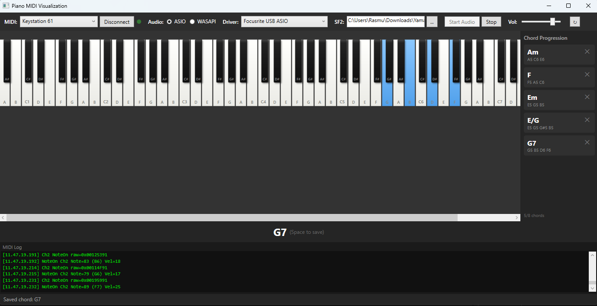

# Piano MIDI Visualization

A Windows desktop app that accepts MIDI input from a physical keyboard, plays piano sounds using SoundFont (.sf2) files, and visualizes the played notes on a virtual 88-key piano in real-time.



## Features

- **MIDI input** — connect any MIDI keyboard and see notes light up as you play
- **SoundFont playback** — realistic piano sounds via .sf2 files (MeltySynth synthesizer)
- **ASIO support** — ultra-low latency audio output (~5ms) with ASIO drivers
- **WASAPI fallback** — works without ASIO using Windows built-in audio
- **Real-time visualization** — 88-key piano with animated key highlighting
- **MIDI log** — scrolling console showing all raw MIDI messages for debugging
- **Settings persistence** — device selections and preferences saved between sessions

## Download

Get the latest `win-x64.zip` from [Releases](https://github.com/FrankDrebin893/PianoVisualization/releases), unzip it and run `PianoMidiVisualizationApp.exe`. It's self-contained, so no .NET install is needed. The app isn't code-signed yet, so Windows may show "Windows protected your PC" — click **More info → Run anyway**.

## Requirements

- Windows 10/11 (64-bit)
- A MIDI keyboard (connected via USB or MIDI interface)
- A SoundFont (.sf2) or SFZ (.sfz) piano — none is bundled. Free options include [GeneralUser GS](https://schristiancollins.com/generaluser.php), [FluidR3](https://github.com/musescore/MuseScore/tree/master/share/sound) or [Salamander Grand Piano](https://sfzinstruments.github.io/pianos/salamander)
- (Optional) An ASIO driver — [ASIO4ALL](https://asio4all.org/) works as a universal option

## Building

Building from source needs the [.NET 10 SDK](https://dotnet.microsoft.com/download/dotnet/10.0).


```bash
dotnet build PianoMidiVisualizationApp.sln
```

## Running

```bash
dotnet run --project src/PianoMidiVisualizationApp
```

## Usage

1. Open **View → Settings…** (Ctrl+,)
2. Select your MIDI keyboard from the **MIDI** dropdown and click **Connect**
3. Click **...** next to SF2 to browse for a SoundFont or SFZ file
4. Choose **ASIO** or **WASAPI** and select your audio driver
5. Click **Start Audio**
6. Play your keyboard — you'll hear sound and see keys highlight on the virtual piano

The green dot next to the MIDI controls flashes when MIDI data is received. The MIDI log panel at the bottom shows all incoming messages.

## Tech Stack

- **C# / .NET 10 / WPF** — desktop UI framework
- **NAudio** — MIDI input, ASIO and WASAPI audio output
- **MeltySynth** — pure C# SoundFont synthesizer
- **CommunityToolkit.Mvvm** — MVVM data binding

## License

[MIT](LICENSE)
