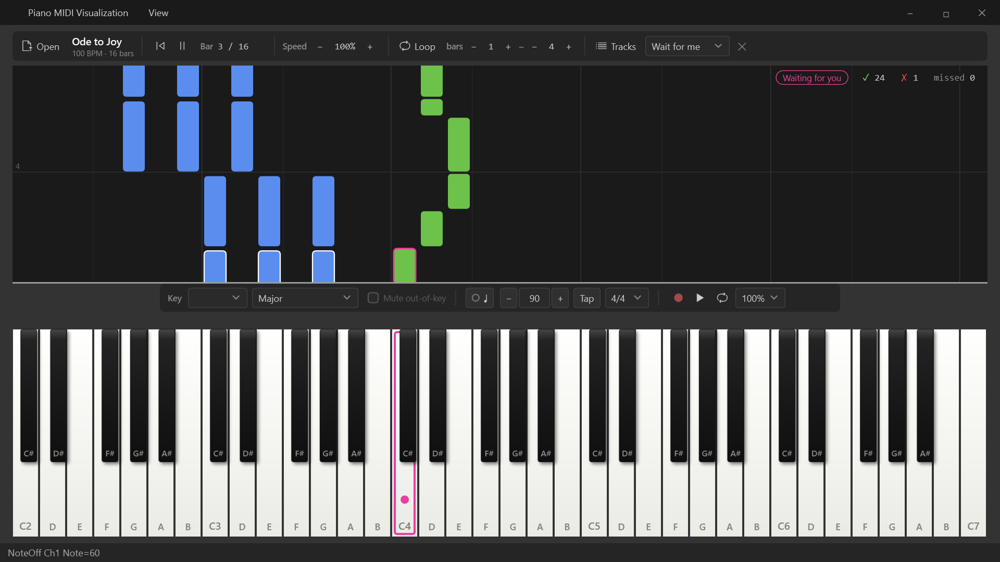
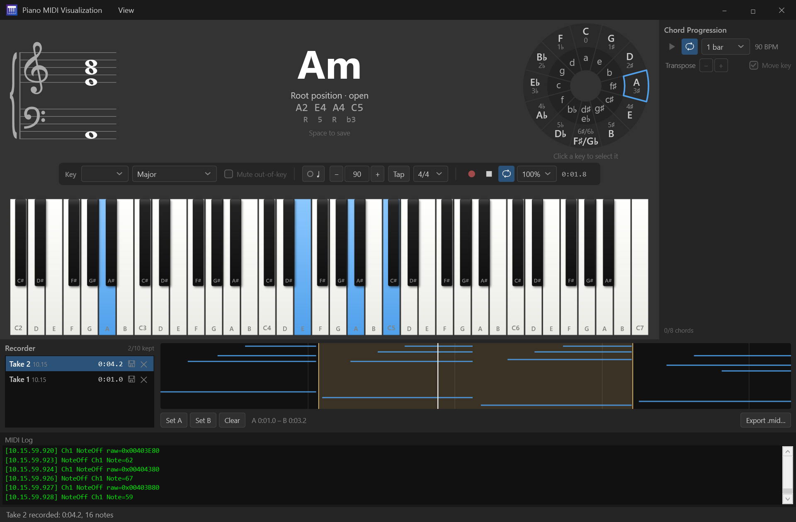
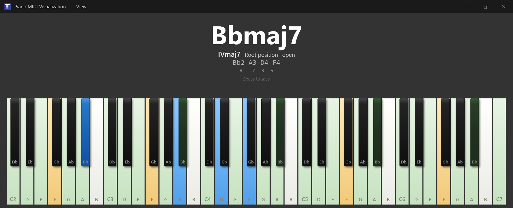

# Piano MIDI Visualization

A Windows desktop app for practising piano with a MIDI keyboard. It plays your keyboard through
any SoundFont (`.sf2`) or SFZ piano with low-latency audio. As you play, it shows the keys you're
holding, the chord's name and Roman numeral, the notes on a grand staff and where the chord sits
on the circle of fifths. You can also practise MIDI songs with falling notes, record takes, and
build and play back chord progressions.


*Holding G7/B in C major. The readout gives the chord's figured-bass numeral (V65), inversion
and voicing. The staff, circle of fifths and chord strip all follow it, and the sidebar
suggests where the saved progression could go next.*

## Features

### Hear and see what you play

- **Any MIDI keyboard**: USB or through a MIDI interface. Held keys light up on a 61-key
  keyboard (C2–C7) that scales with the window.
- **SoundFont and SFZ pianos**: `.sf2` files play through the MeltySynth synthesizer. `.sfz`
  instruments such as [Salamander Grand Piano](https://sfzinstruments.github.io/pianos/salamander)
  play through a built-in sample player with velocity layers.
- **Low-latency audio**: ASIO output (around 5 ms with a good driver), with WASAPI as a
  fallback that needs no extra drivers.

### Understand what you play

- **Chord readout**: the chord's name, including slash chords, sevenths and extensions. Below
  it are the inversion, the voicing (close, open, shell or drop 2), each note, and its interval
  above the root.
- **Keys and scales**: pick a key centre and one of 12 scales: major, natural, harmonic and
  melodic minor, the five other modes, major and minor pentatonic, and blues. In-key notes
  are tinted on the keyboard, the tonic stands out, and note names switch between sharps and
  flats to suit the key.
- **Mute out-of-key**: out-of-key notes go silent but still light up and still count toward the
  chord name, so you can hear the scale and see your mistakes.
- **Roman numerals**: the held chord's function in the key, with figured-bass inversions (V65,
  IVmaj7, viiø7).
- **Grand staff**: the held notes in standard notation, spelled correctly for the key and shown
  with its key signature.
- **Circle of fifths**: highlights the selected key and the current chord's root. Click a
  segment to change key.
- **Diatonic chord strip**: every chord in the key as triads or sevenths. The one you're
  playing lights up, and clicking a tile plays it.

### Build chord progressions

- Press **Space** to save the chord you're holding to the **Chord Progression** sidebar, up to
  eight chords, each with its numeral and notes.
- **Play it back** at the metronome's tempo, looped if you like, giving each chord one bar or
  one to eight beats (**Ctrl+P**).
- **Transpose** the whole progression by semitones. Tick **Move key** and the key moves with
  it, so the numerals stay the same.
- **Next chord suggestions** use common functional-harmony moves from the last chord (V to I or
  vi, ii to V, and so on), each voiced to lead smoothly from it. Hover a suggestion to see it on
  the keyboard, and click it to add it.

### Practise songs with falling notes



- **Open any MIDI file** (**Ctrl+O**), and its notes fall toward the keys they belong to. A
  two-handed piano track is split into right and left hand at middle C, each in its own colour.
- **Tracks**: decide who plays each part: **You play**, **Auto-play** (the app plays it as
  accompaniment) or **Mute**.
- **Wait for me**: the song stops at each of your chords until you play it, with the keys to
  press marked on the keyboard.
- **Play along**: the song keeps going, and each note is scored as correct, wrong or missed.
- **Speed** from 25% to 100%, **loop** a range of bars, and restart from the top or from the
  loop start. If song practice is open when you quit, the song reopens next time.

### Record yourself



- Press **Ctrl+R** to arm the recorder. Recording starts at your first note, so there's no
  silence to trim. The last ten takes are kept.
- **Play back** at 50%, 75% or 100% speed (**Ctrl+Shift+R**), looping the whole take or just
  an **A–B** region. Drag across the timeline to set the region, or click it to jump there.
- **Export** any take as a `.mid` file.

### Keep time

- A **metronome** in the toolbar: 30–240 BPM, **Tap** tempo, and a choice of beats per bar with
  an accented downbeat. Its beat light follows the audio clock, so it never drifts from the
  click you hear (**Ctrl+M**).

### Arrange the screen



- Every panel can be shown or hidden from the **View** menu or its shortcut. **Zen mode**
  (**F11**) hides everything but the chord readout and the keyboard, and F11 again brings your
  layout back.
- **MIDI log**: a scrolling list of every raw MIDI message, handy when a keyboard misbehaves.
- **AI Music Assistant** (optional): a chat panel for music theory and practice questions. It
  knows the chord you're holding, the selected key and your saved progression. It uses Google
  Gemini (`gemini-2.5-flash-lite`) and needs your own Gemini API key. Your messages and that
  context are sent to Google.
- **Everything is remembered**: devices, sound, key, metronome, panel layout, window position
  and the open song are saved to `%LOCALAPPDATA%\PianoMidiVisualizationApp\settings.json`.
  MIDI and audio reconnect by themselves on the next launch.

## Keyboard shortcuts

| Shortcut | Action |
|---|---|
| **Space** | Save the held chord to the progression |
| **Ctrl+,** | Settings (**Esc** closes them) |
| **F11** | Zen mode |
| **Ctrl+M** | Metronome on/off |
| **Ctrl+R** | Record / stop recording |
| **Ctrl+Shift+R** | Play / stop the selected take |
| **Ctrl+P** | Play / stop the chord progression |
| **Ctrl+O** | Open a MIDI song |
| **Shift+F1** | Status bar |
| **Shift+F2** | AI Music Assistant |
| **Shift+F3** | MIDI log |
| **Shift+F4** | Chord progression sidebar |
| **Shift+F5** | Recorder |
| **Shift+F6** | Circle of fifths |
| **Shift+F7** | Chord strip |
| **Shift+F8** | Grand staff |
| **Shift+F9** | Song practice |

## Download

Get the latest `win-x64.zip` from [Releases](https://github.com/FrankDrebin893/PianoVisualization/releases), unzip it and run `PianoMidiVisualizationApp.exe`. It's self-contained, so no .NET install is needed. The app isn't code-signed yet, so Windows may show "Windows protected your PC" — click **More info → Run anyway**.

## Requirements

- Windows 10/11 (64-bit)
- A MIDI keyboard (connected via USB or MIDI interface)
- A SoundFont (.sf2) or SFZ (.sfz) piano — none is bundled. Free options include [GeneralUser GS](https://schristiancollins.com/generaluser.php), [FluidR3](https://github.com/musescore/MuseScore/tree/master/share/sound) or [Salamander Grand Piano](https://sfzinstruments.github.io/pianos/salamander)
- (Optional) An ASIO driver — [ASIO4ALL](https://asio4all.org/) works as a universal option
- (Optional) A [Google Gemini API key](https://aistudio.google.com/apikey), for the AI Music Assistant

## Getting started


1. Open **View → Settings…** (**Ctrl+,**).
2. Select your MIDI keyboard from the **Keyboard** dropdown and click **Connect**.
3. Choose **ASIO** or **WASAPI** under **Output**, and select your audio device.
4. Click **Choose…** next to **Piano sound** to pick a SoundFont or SFZ file.
5. Click **Start audio**.
6. Play. You'll hear sound and see the keys light up. Pick a **Key** in the toolbar to turn on
   the Roman numerals, chord strip and key tinting.

The dot next to **Connect** turns green once the keyboard is connected and flashes when MIDI
data arrives. **Volume** sets the master volume and **Click** the metronome. To use the AI
assistant, paste your Gemini API key into **Gemini key**.

## Building

Building from source needs the [.NET 10 SDK](https://dotnet.microsoft.com/download/dotnet/10.0).

```bash
dotnet build PianoMidiVisualizationApp.sln
```

## Running

```bash
dotnet run --project src/PianoMidiVisualizationApp
```

## Tech Stack

- **C# / .NET 10 / WPF**: desktop UI framework
- **NAudio**: MIDI input, ASIO and WASAPI audio output
- **MeltySynth**: pure C# SoundFont synthesizer
- **DryWetMIDI**: MIDI file reading and writing (song practice, take export) and chord naming
- **CommunityToolkit.Mvvm**: MVVM data binding

The screenshots are rendered from the real UI with a small harness in
[`.claude/skills/update-readme/screenshots`](.claude/skills/update-readme/screenshots). Run
`dotnet run --project .claude/skills/update-readme/screenshots` to regenerate them.

## License

[MIT](LICENSE)
